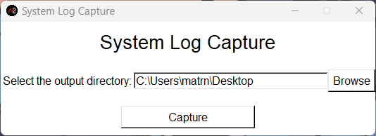

# system-log-capture

A means to pull any possible meaningful logs, so engendering may look over for debug, troubleshooting, and analysis.

## How to develop

1. [Install python 3.11.4 or higher](https://www.python.org/downloads/)
2. Clone the repository
3. Create your [Python virtual environment](https://docs.python.org/3/library/venv.html)
   1. If your virtual environment is in the project be sure to gitignore the folder
4. [Activate your virtual environment](https://docs.python.org/3/tutorial/venv.html)
5. `pip install -r requirements.txt`
6. Have fun developing 🙂

## TODO

- [ ] Add "Capture System Logs" button in the GUI
  - [ ] Function: Produce a logs in a zipped folder with
        naming convention YYYYMMDDTHHMM-captured-system-logs
  - [ ] All logs should be saved as JSON, so we can possibly
        produce a browser dashboard to view pulled logs
- [ ] Add a "Reset to default output directory" button
