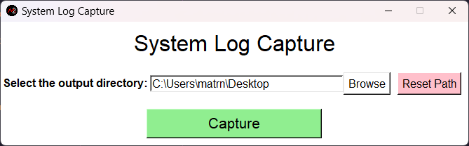

# System Log Capture

A means to pull any possible meaningful logs, so engendering
may look over for debug, troubleshooting, and analysis.

## How to develop

1. [Install python 3.11.4 or higher](https://www.python.org/downloads/)
2. Clone the repository
3. Create your [Python virtual environment](https://docs.python.org/3/library/venv.html)
   1. If your virtual environment is in the project be sure to gitignore the folder
4. [Activate your virtual environment](https://docs.python.org/3/tutorial/venv.html)
5. `pip install -r requirements.txt`
6. Have fun developing 🙂

## Project organization

`app.py` handles which version of the app gets used `gui` or the `cli`;
in addition, detects the respective operating system the app is running on,
so that the respective logging functions can run on it's native OS.

`core.py` contains the "core" functions of the application agnostic of the
operating system it's used in.

`gui.py` must only have gui specific functions in file.

## Project dependencies

- flake8
- pyautogui

## TODO

- [x] Add "Capture System Logs" button in the GUI
  - [ ] Function: Produce a logs in a zipped folder with
        naming convention YYYY-MM-DD_HH-MM-SS-captured-system-logs
  - [ ] All logs should be saved as JSON, so we can possibly
        produce a browser dashboard to view pulled logs
- [ ] Add a "Reset to default output directory" button
